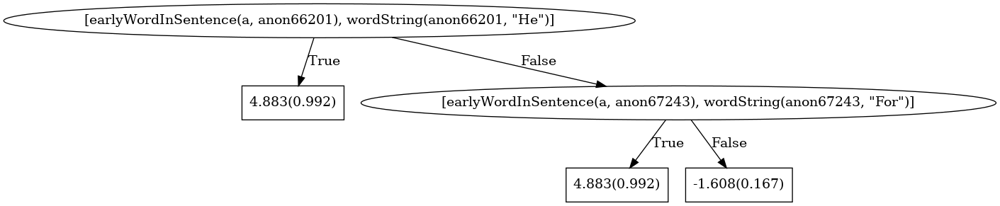

========
Learning
========

*This is a brief overview of a learning task. Requirements for a more specific task may vary substantially based on the goals or the data available to you.*

We now have ``bk.txt`` and ``facts.txt`` as a result of the previous step. In order to get show some results, we will construct a toy data set from predicates easily available in the facts file.

The *Delcaration of Independence* contains a set of phrases called the "List of Grievances", where the Founders spell out the 27 violations by King George III.

We can turn these into a text classification task where we learn the structure of the grievances.

Positive and Negative Examples
------------------------------

Labeling data is often a task of its own, but we will take a shortcut and label sentences beginning with **"He"** or **"For"** as being positive examples. Everything else is labeled as negative.

1. Create a 'train' directory for our training data.

  .. code-block:: bash

    mkdir train

2. This combination of grep, awk, and sort finds all occurances of "He" and "For" in the facts; labels them as a positive example; and adds them to a train_pos.txt file.

  .. code-block:: bash

    grep "'He'\|'For'" facts.txt |
      awk '{gsub("wordString","sentenceContainsTarget");
            gsub("_[0-9]*,.*",").");
            print}' |
      sort -u > train/train_pos.txt

3. This command does something similar, but returns all sentences *not* containing the example.

  .. code-block:: bash

    grep "wordString" facts.txt |
      grep -v "'He'\|'For'" |
      awk '{gsub("wordString","sentenceContainsTarget");
            gsub("_[0-9]*,.*",").");
            print}' |
      sort -u > train/train_neg.txt

4. Some sentences have been counted twice--some negative examples are also present in the positive examples. Luckily we can do a set difference to fix this.

  .. code-block:: bash

    sort train/train_neg.txt train/train_pos.txt train/train_pos.txt |
      uniq -u > temp; mv temp train/train_neg.txt

5. We want to learn about the structure of sentences, so we will replace the default target with our own and move a copy into the train/ directory.

  .. code-block:: bash

    awk '{gsub(".*Target.*",
               "mode: sentenceContainsTarget(+SID).");
          print}' bk.txt > train/train_bk.txt

6. Finally, move the facts into the same directory.

  .. code-block:: bash

    mv facts.txt train/train_facts.txt

Our train directory should now contain four files, and the 27 positive examples each correspond to one of the grievances.

.. code-block:: bash

  train_bk.txt          18 lines
  train_facts.txt     6736 lines
  train_neg.txt         17 lines
  train_pos.txt         27 lines

BoostSRL
--------

Now that our data is organized, we use `BoostSRL <https://starling.utdallas.edu/software/boostsrl/>`_ for learning. Download a copy of the jar file from the website and move it to the base of the repository.

.. code-block:: bash

  java -jar v1-0.jar -l -combine \
       -train train/ -target sentenceContainsTarget \
       -trees 25

As expected, the model says that if a word appears early in a sentence, and the string representation of that word is "He": the sentence is likely to be a member of the list of grievances (0.992).

Otherwise, the model makes the same check for the word "For", assigning a high probability if it is (0.992) and a lower probability if not (0.167).

We can interpret this model as saying "If an early word in the sentence is 'He' or 'For', the sentence is part of the list of grievances."
